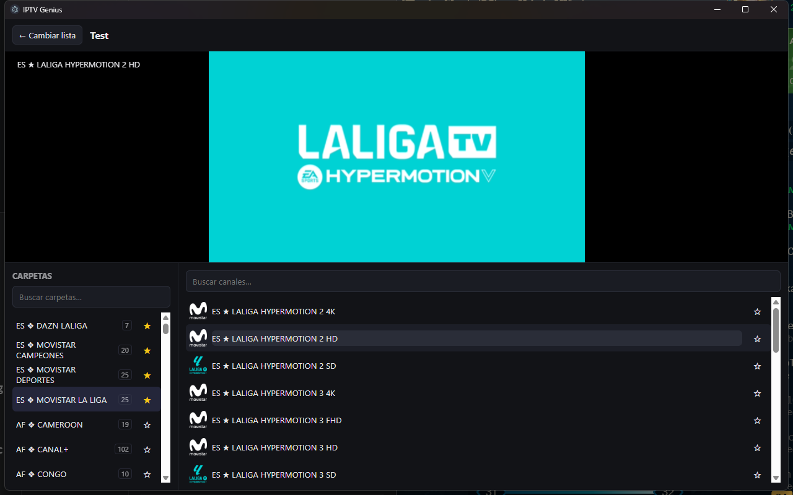

# IPTV Genius

A fast, native-feeling IPTV desktop app for Windows. Import M3U/M3U8 playlists or Xtream Codes accounts, browse live channels, movies, and series, and watch — all in a lightweight Electron + React app built to stay smooth even with playlists that have tens of thousands of channels.



## Features

- **M3U / M3U8 playlists** — import from a URL or a local file.
- **Xtream Codes accounts** — full `player_api.php` integration (live channels, categories, and more coming).
- **Smart Xtream detection** — pasting an Xtream `get.php` playlist link (or an M3U that's really a flat Xtream export) offers to import it as a proper Xtream account instead, so you don't lose categorization.
- **Two-column browsing** — pick a folder, then its channels, both virtualized so huge playlists stay instant and responsive.
- **Per-column search** — filter folders and channels independently, entirely client-side (no lag).
- **Favorites** — star individual channels *and* whole folders for quick access.
- **Multi-format playback** — routes HLS to `hls.js` and raw MPEG-TS to `mpegts.js`, whichever the stream needs.
- **Playback fallbacks for tricky streams** — some IPTV feeds use audio codecs (e.g. MP2, AC-3/EAC-3) that Chromium's Media Source Extensions can't decode. When that happens, IPTV Genius offers to either open the stream in VLC/mpv, or transparently transcode just the audio track locally (via a bundled `ffmpeg`, video is stream-copied, not re-encoded) and retry in-app.

## Tech stack

- **Electron + React + TypeScript**, built with `electron-vite`.
- **better-sqlite3** for local storage (sources, channels, favorites) — chosen because the folder/category browsing relies on indexed, relational queries, not just key-value storage.
- **`@iptv/xtream-api`, `@iptv/playlist`, `@iptv/xmltv`** for Xtream/M3U/XMLTV parsing.
- **`hls.js`** / **`mpegts.js`** for in-browser playback, **`ffmpeg-static`** for the local audio-remux fallback.
- **Zustand** + **TanStack Query** for renderer state.
- **`react-window`** for virtualized lists.

The business logic (`packages/core`) is plain TypeScript with no Electron/DOM dependency, so it isn't tied to the Electron shell.

## Getting started

Requires Node.js 22+.

```bash
npm install
npm run dev
```

This starts the app with hot-reload for the renderer and auto-rebuild for the main process.

### Building a Windows installer

```bash
npm run build:win
```

Produces both an NSIS installer and a portable `.exe` in `dist/`.

### Type-checking

```bash
npm run typecheck
```

## Project structure

```
iptv-genius/
├── packages/
│   ├── core/            # Framework-agnostic domain logic: Xtream client, M3U/XMLTV
│   │                     # parsing, SQLite schema & queries, domain types
│   └── ipc-contract/     # Shared types for the main <-> renderer IPC boundary
└── src/
    ├── main/             # Electron main process: window, IPC handlers, services
    ├── preload/           # contextBridge — the only surface the renderer can call
    └── renderer/          # React UI
```

## Roadmap

- [x] Playlist/Xtream import, live playback, folders, favorites, search
- [ ] EPG (XMLTV + Xtream short EPG) with a now/next guide
- [ ] VOD (movies) and series browsing with resume playback
- [ ] Packaging polish (code signing, auto-update)

## Contributing

Issues and PRs are welcome. This is an early-stage personal project, so expect the architecture to evolve — if you're planning a larger change, opening an issue first is a good idea.

## License

[MIT](LICENSE)
